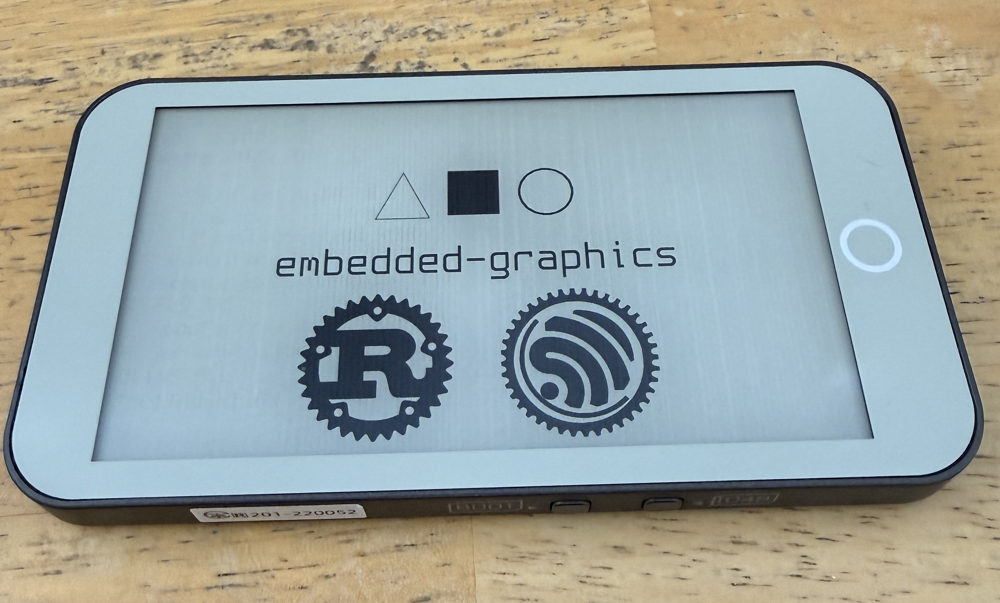

# LilyGo T5 S3 ePaper Pro



Rust driver and UI firmware for the [LilyGo T5 E-Paper S3 Pro](https://lilygo.cc/products/t5-e-paper-s3-pro)
device family (ESP32-S3, ED047TC1 4.7" panel).

Forked from
[azw413/lilygo-t5s3paperpro-rs](https://github.com/azw413/lilygo-t5s3paperpro-rs)
(itself a fork of [fridolin-koch/lilygo-epd47-rs](https://github.com/fridolin-koch/lilygo-epd47-rs)).

Hardware behavior was reverse-engineered from the vendor firmware at
[Xinyuan-LilyGO/T5S3-4.7-e-paper-PRO](https://github.com/Xinyuan-LilyGO/T5S3-4.7-e-paper-PRO).

## project layout

| Path | What |
| --- | --- |
| `crates/t5s3-epaper-core` | the driver library (display, touch, RTC, SD, LoRa, GPS, power, frontlight) plus all hardware examples. |
| `crates/t5s3-epaper-ui` | binary firmware: the touchscreen UI (wifi clock, LoRa keyboard messenger, GPS, wallpapers). |
| `tools/wallpaper` | tool to convert images into the BMP format the UI loads from SD. built with the host toolchain (excluded from the embedded workspace). |

## requirements

- The Espressif Rust toolchain via [`espup`](https://github.com/esp-rs/espup)
  (this repo pins `channel = "esp"` in `rust-toolchain.toml`).
- [`espflash`](https://github.com/esp-rs/espflash) for flashing/monitoring
  (the cargo runner is preconfigured in `.cargo/config.toml`).
- Optional: [`just`](https://github.com/casey/just) for the convenience recipes.

The cargo runner flashes **and** opens the serial monitor, so `cargo run …`
builds, flashes the connected board, and tails its output.

## examples

Examples live in the core crate. Plain examples need no extra features:

```sh
cargo run -p t5s3-epaper-core --example hello-world
```

Some examples require a feature flag (declared via `required-features`, so cargo
will tell you if one is missing):

```sh
cargo run -p t5s3-epaper-core --example gps   --features gps          # GPS module readout
cargo run -p t5s3-epaper-core --example lora  --features lora         # LoRa radio
cargo run -p t5s3-epaper-core --example clock --features wifi         # wifi NTP clock (see .env below)
```

| Example | Feature | Description |
| --- | --- | --- |
| `hello-world` | — | Minimal draw plus a bundled BMP image. |
| `simple` | — | Smallest embedded-graphics draw. |
| `counter` | — | Partial-refresh counter. |
| `grayscale` | — | 16-level grayscale rendering. |
| `rotation` | — | Display rotation modes. |
| `input` | — | Read the physical buttons. |
| `touchscreen` | — | Read the capacitive touch panel. |
| `frontlight` | — | Drive the frontlight brightness. |
| `battery` | — | Read battery voltage / level. |
| `temperature` | — | Read the onboard temperature sensor. |
| `rtc-clock` | — | RTC-backed clock (no network). |
| `sdcard` | — | List and read files from the microSD slot. |
| `deepsleep` | — | Deep sleep and wake. |
| `screen-repair` | — | Panel repair routine (adapted from LilyGo). |
| `clock` | `wifi` | NTP clock over wifi. |
| `gps` | `gps` | GPS module detection and fix readout. |
| `lora` | `lora` | LoRa send/receive. |
| `lora_send` | `lora` | LoRa transmitter. |
| `lora_recv` | `lora` | LoRa receiver. |

Or via `just`:

```sh
just clock   # the wifi clock example
just check   # compile-check everything
just lint    # fmt + clippy across the workspace
```

## flashing the UI

The UI bakes wifi credentials in at build time, so configure them first:

```sh
cp .env.example .env    # then fill in SSID / PASSWORD / TZ_OFFSET_HOURS
```

Then flash and monitor:

```sh
just ui
# equivalent to:
SSID=… PASSWORD=… TZ_OFFSET_HOURS=… \
  cargo run -p t5s3-epaper-ui --features gps
``

notes:
- GPS support is optional — drop `--features gps` to build the UI without it (the
GPS page then shows a "compile with --features gps" hint). 
- The UI loads
wallpapers as BMP files from the SD card from `WALLS/` in the root; use `tools/wallpaper` to prepare them.

