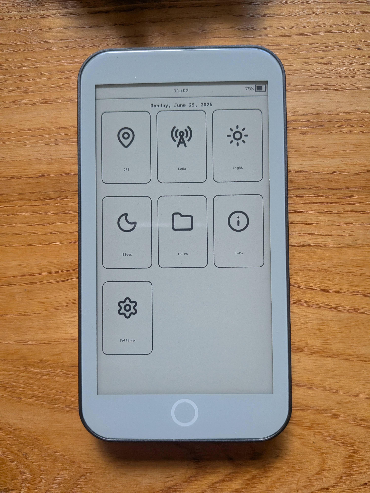

# lilygo-epaper

<p align="center">
  
  
  
</p>

Rust drivers and firmware for LilyGo ESP32-S3 e-paper boards. Supports T5-S3 Pro and T3-S3 e-paper.

## crates

| Path | What | Readme |
| --- | --- | --- |
| `crates/t5s3-epaper-core` | T5 S3 driver library (display, touch, RTC, SD, LoRa, GPS, power, frontlight) plus all hardware examples. | [readme](crates/t5s3-epaper-core/README.md) |
| `crates/t5s3-epaper-ui` | T5 S3 touchscreen UI firmware (wifi clock, LoRa keyboard messenger, GPS, wallpapers). | [readme](crates/t5s3-epaper-ui/README.md) |
| `crates/t3s3-epaper` | T3-S3 LoRa e-paper board: SX1262 + SSD1680 drivers and examples (BLE / wifi LoRa bridges). | [readme](crates/t3s3-epaper/README.md) |
| `tools/wallpaper` | host tool to convert images into the BMP format the UI loads from SD. built with the host toolchain (excluded from the embedded workspace). | — |

## requirements

- The Espressif Rust toolchain via [`espup`](https://github.com/esp-rs/espup)
  (this repo pins `channel = "esp"` in `rust-toolchain.toml`).
- [`espflash`](https://github.com/esp-rs/espflash) for flashing/monitoring
  (the cargo runner is preconfigured in `.cargo/config.toml`).
- Optional: [`just`](https://github.com/casey/just) for the convenience recipes.

The cargo runner flashes **and** opens the serial monitor, so `cargo run …`
builds, flashes the connected board, and tails its output.

## just recipes

```sh
just clock   # flash the wifi clock example          (t5s3-epaper-core)
just ui      # flash the touchscreen ui              (t5s3-epaper-ui)
just ble     # flash the ble ⇄ lora bridge example   (t3s3-epaper)
just check   # compile-check the whole workspace
just lint    # fmt + clippy across the workspace
```

See each crate's readme for the full example/flashing details:

- T5 S3 driver + examples → [`crates/t5s3-epaper-core`](crates/t5s3-epaper-core/README.md)
- T5 S3 UI firmware → [`crates/t5s3-epaper-ui`](crates/t5s3-epaper-ui/README.md)
- T3-S3 LoRa board → [`crates/t3s3-epaper`](crates/t3s3-epaper/README.md)
